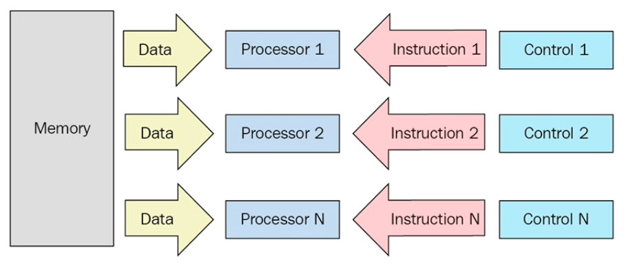

# Advanced Programming in Python
This repository aims at making the reader fluent in python language. If you need to review the fundamentals go [here](https://github.com/ehsanyousefzadehasl/PF) which reviews python syntax with exercises.

Also, here there are some exxercises that summarises for you basic python.
- [Favorite genres to be counted and sorted based on two keys with different orders](code/01-intro/03-favorite-genres.py)
- [To show a number that its prime dividers count is max in a given lists](code/01-intro/04-max_num_of_prime_divider.py)

- [String operations and sorting based on two keys](code/01-intro/05-olympiad_list.py)
- [Detecting capitalized words in several sentences](code/01-intro/06-index_words_in_a_paragraph.py)
- [a translator using dictionary](code/01-intro/07-pocket_translator.py)

## Introduction
### lambda, map, filter
After learning the basic structures of a programming language like conditionals flows, variables etc. the programmer can develop whatever the project needs. However,being able to use advanced structures of a language is something different, like **LAMBDA FUNCTIONS** in python language. Also, learning advanced programming paradigms, like OOP in this course are considered.

In the following snippet, it is shown how **lambda** make a programmer's life much easier. The following program detects the odd and even numbers in a given list. Actually map applies a function to each of the elements of a given list.

```python
a = [1, 2, 3, 4, 12, 12, 324, 45]
print(list(map(lambda x: "even" if x % 2 == 0 else "odd",a)))

# output
#['odd', 'even', 'odd', 'even', 'even', 'even', 'even', 'odd']
```

```python
array = [(1,4,5), (3,2,7), (8,3,6), (9,2,3)]
array.sort(key = lambda a:a[2])
print(array)

# output
# [(9, 2, 3), (1, 4, 5), (8, 3, 6), (3, 2, 7)]
```

```python
mylist = [2,3,5,8,11,14,17,102,44]
print(list(map(lambda x:'Odd' if  x%2==1 else 'Even',mylist)))

# output
# ['Even', 'Odd', 'Odd', 'Even', 'Odd', 'Even', 'Odd', 'Even', 'Even']
```

```python
mylist = [2,15,26,8,11,14,17,102,44]
map_list = map(lambda x:x%10,mylist)
filter_list = list(filter(lambda x: x<=4,map_list))
print(filter_list)

# output
# [2, 1, 4, 2, 4]
```

```python
mylist = ['yellow', 'red', 'blue','red','yellow','red','blue','purple']
mylist.sort()
mylist = list(map(lambda x: 'color' if x=='red' else x,mylist))
output = list(filter(lambda x: x=='red',mylist))
print(output)

# output
# []
```

FILTERs are another useful structure in python as it's shown in the following snippet.

```python
[1, 2, 3, 4, 12, 12, 324, 45]
list(filter(lambda x: x%2 == 0, a))
# output: [2, 4, 12, 12, 324]
```

### Generators
Generators are used to **create iterators**, but with a different approach. Generators are simple functions which return an iterable set of items, one at a time, in a special way. When an iteration over a set of item starts using the for statement, the generator is run. Once the generator's function code reaches a "yield" statement, the generator yields its execution back to the for loop, returning a new value from the set. The generator function can generate as many values (possibly infinite) as it wants, yielding each one in its turn.
```python
import random

def lottery():
    # returns 6 numbers between 1 and 40
    for i in range(6):
        yield random.randint(1, 40)

    # returns a 7th number between 1 and 15
    yield random.randint(1,15)

for random_number in lottery():
       print("And the next number is... %d!" %(random_number))
# output
# And the next number is... 13!
# And the next number is... 22!
# And the next number is... 15!
# And the next number is... 25!
# And the next number is... 20!
# And the next number is... 23!
# And the next number is... 7!
```

```python
def fib():
    a, b = 1, 1
    while 1:
        yield a
        a, b = b, a + b

# testing code
import types
if type(fib()) == types.GeneratorType:
    print("Good, The fib function is a generator.")

    counter = 0
    for n in fib():
        print(n)
        counter += 1
        if counter == 10:
            break
# output
# Good, The fib function is a generator.
# 1
# 1
# 2
# 3
# 5
# 8
# 13
# 21
# 34
# 55
```

Generators are memory efficient (they are returning on demand) compared to the iterators and also code size efficient.

## OOP
In this paradigm, every object in the real world is going to be modeled as a class in the digtial world. Relationships can be defined between classes, for example consider we want to develop a system for a university to keep the information of the university's staff. If we start with a "person" class and have first_name, last_name, birth_date, national_ID properties, and some getters and setters for them, in another class like professor, we can inheret these attributes and functions, and no need to write them again.

```python
class Person:
    count = 0
    def __init__(self, name, age):
        self.name = name
        self.age = age
        Person.count = Person.count + 1

    def get_name(self):
        print('This object\'s name is %s'%self.name)

    def get_age(self):
        print('This object\'s age is %d'%self.age)

    def get_info(self):
        print('name: %s, age: %d'%(self.name, self.age))

    def return_count_of_persons(self):
        return Person.count

    def __del__(self):
        count = count - 1

ehsan = Person('ehsan', 26)
ehsan.get_name()
ehsan.get_age()
ehsan.get_info()

john = Person("Johnny", 12)
Ahmet = Person("Ahmet Kaya", 65)

print("Number of persons: %d" % ehsan.return_count_of_persons())

del Ahmet

print("Number of persons: %d" % ehsan.return_count_of_persons())

# output
# This object's name is ehsan
# This object's age is 26
# name: ehsan, age: 26
# Number of persons: 3
# Number of persons: 2
```

For inheritance, we just put the name of the parent class in the child class.

```python
class Parent;
    ...

class Child(Parent):
    ...
```

Check the following examples to have a better vision in OOP:
- [OOP Example 1](code/02-OOP/03-milk-impact.py)
- [OOP Example 2](code/02-OOP/04-age_calculator.py)
- [OOP Example 3](code/02-OOP/05-football_player.py)


## Databases
In this part, we aim at connecting mysql to python. First  of all, make sure that you have MySQL installed on your machine and you can connect it. with the following command in MySQL command line see what is going on:
```sql
show databases; -- to see the databases

create database a_db_name_you_want_to_create; -- create a table

use a_db_name_you_want_to_create; -- to switch in to the database 

show tables; -- to see the tables in the database you are

create table a_table_name (column1 column1_type, column2 column2_type, column3 column3_type, column4 column4_type, column5 column5_type, column6 column6_type, ...);

-- example
CREATE TABLE pet (name VARCHAR(20), owner VARCHAR(20), species VARCHAR(20), sex CHAR(1), birth DATE, death DATE);

describe a_table_name; -- to see the description or schema of the table

drop table a_table_name; -- to drop the table you created

drop database a_db_name_you_want_to_create; -- to delete the database you created recently
```

Then install the python-connector package to be able to connect to your database from python code as follow:

```python
pip install mysql-connector

pip install pymysql

mysql-connector-python
```

Following snippet is what you interact easily with your databases through python code:

```python
import mysql.connector

print("connecting to db")
cnx = mysql.connector.connect(user='root', password='your_password', host='127.0.0.1',
database='your_db_name')
print("connected to db")

cursor = cnx.cursor()
cursor.execute("INSERT INTO pet values('cat', 'Akbar','mammal', 'f', '1994-07-12', '2009-12-12');")

cursor.execute("select * from pet;")

for element in cursor:
    print(element)

cnx.commit()

cnx.close()

# output
# connecting to db
# connected to db
# ('Puffball', 'Diane', 'hamster', 'f', datetime.date(1999, 3, 30), None)
# ('cat', 'Akbar', 'mammal', 'f', datetime.date(1994, 7, 12), datetime.date(2009, 12, 12))
# ('cat', 'Akbar', 'mammal', 'f', datetime.date(1994, 7, 12), datetime.date(2009, 12, 12))
```

Check other two examples from the links below:
1. [A simple SQL order by example](code/03-DB/02-exercise1.py)
2. [An email and password validator](code/03-DB/03-exercise2.py)

Non-relational databases are for reducing the design and time of development a system. There are many different non-relational databases like MongoDB, and Cassabdra etc. We as developers just have to search and connect to our python, then change our data. It is simple enoguh at least for using them.

## Web Scraping
The aim of this season is to read data from a website, and process or filter the information from it. First, we dive into **regex**, which is a requirement for this purpose to reduce our code size and also ease our work on working with strings. You can test your regex expressions online like [here](https://regex101.com/).

- '.' means everything can be this character.
- [] is for specifying or, for example [a, b, c] mentions that this character can be a or b or c.
- \d -> digit
- \w -> a,b,c,...,z,_
- \s -> white space (tab, space, newline, etc.)
- * -> from zero character to infinity
- + -> at least one character
- \ch -> it shoud ended with "ch" character
- () -> grouping the desired part
- [^] -> negator
- ^ -> start of a line
- $ -> end of a line
- Some special characters: \t, \n, \r
- {n} -> n specifies the number of characters
- \ -> used for specifying the character that we want it to be in the regular expression like: \\.

Some example with these:
```python
# 1 - a string with four character started, and ended with white spaces
\s....\s

# 2 - at least the desired string must have a "a" character: a, aa, aaa, aaaa, ...
a+

# 3 - no matter how many "a"s, from zero to infinity: "", a, aa, aaa, ...
a*

# 4 - detecing a email, what spammer do :D
([^\s]+@[^\s]+)

# The start of the line must have 1
^1

# Every thing except a and b
[^ab]

# Detects numbers in the beginning of a line
(^\d+$)

# For separating the firstname, middlename, and lastname - in some countries, people do not have middlename
^(\w+)\.*(\w*)\.(\w+)
```

Regex is well-known for being greedy. We can make them to take life easier by using "?".

```python
# input: this is the 1st end. this is the 2nd end.
this .*? end
# output: this is the 1st end this is the 2nd end
```
### Regular Expression in Python
The package that enables us to work with regular expression is "re", and we can import it easily as follows:

```python
import re
```
In python, we have three functions that we use them as shown below:

```python
re.search(r'our_regular_expression', the_string_that_we_want_to_process)

re.findall(r'our_regular_expression', the_string_that_we_want_to_process)

re.sub(r'our_regular_expression', the_string_that_we_want_to_be_substituted, the_string_we_want_to_be_processed)
```
[A very simple email validator Example](code/04-Web-Scraping/01-very-simple-email-checker.py)

### Request in Python for getting a webpage

For reading the content of a webpage, we need just to work with request package in python easily just by importing it.

```python
import requests
```
However, it is not a built-in package int the language, so you have to install it first:

```shell
pip install requests
```

Then, just get the content of a url as follows:

```python
import requests

result = requests.get('https://github.com')

print(result.text)
```

Now, result keeps the data received from the specified url (if successful: http status code: 200). The text attribute keeps the html code of the response, which we can use for our processing goals, for example by using regext. But, there is a package that makes our lives easier: "**Beautiful Soup**". Check the following example, which the first one reads a page content and provides link to desired posts, and the second one stores price and miles of second-hand cars in a database table.

1. [Divar Example](code/04-Web-Scraping/02-divar_website_announcements_with_tag.py)
2. [Truecar Example](code/04-Web-Scraping/03-truecar_analyzer.py)

### Virtual Environment
#### Motivation from Python Documents
Python applications will often use packages and modules that don’t come as part of the standard library. Applications will sometimes need a specific version of a library, because the application may require that a particular bug has been fixed or the application may be written using an obsolete version of the library’s interface.

This means it may not be possible for one Python installation to meet the requirements of every application. If application A needs version 1.0 of a particular module but application B needs version 2.0, then the requirements are in conflict and installing either version 1.0 or 2.0 will leave one application unable to run.

The solution for this problem is to create a virtual environment, a self-contained directory tree that contains a Python installation for a particular version of Python, plus a number of additional packages.

Different applications can then use different virtual environments. To resolve the earlier example of conflicting requirements, application A can have its own virtual environment with version 1.0 installed while application B has another virtual environment with version 2.0. If application B requires a library be upgraded to version 3.0, this will not affect application A’s environment [Reference](https://docs.python.org/3/tutorial/venv.html).

We can create a virtual environment for our project with the following command:
```python
python -m venv name_of_the_ve
```
Then, with the following command, we can activate it (activation means when we install a package with a specific version, it will be installed here), or deactivate it.

```shell
# activate
source name_of_the_ve/Scripts/activate

# simply just deactivate
deactivate
```
In the following snippet, some command of pip for dealing with packages in python are listed, which knowing them equals to power in python (pip is a package manager). There was a search feature in pip allowing to search for packages, but these days because of the cost, it is down.

```shell
# installing a package
python -m pip install package_name

# installing a specific version of a package
python -m pip install package_name==package_version

# upgrading a package
python -m pip install --upgrade a_package

# uninstalling a package
pip uninstall a_package

# Displaying information of a package
pip show a_package

# Listing all of the packages installed
pip list

# A list of packages installed in the virtual environment in the expected format by pip to be installed somewhere else
pip freeze > requirements.txt

# installing requirements of a project
python -m pip install -r requirements.txt
```

### Django Web Framework
It is a framework that eases and makes fast the development process of web applications. After building a virtual environment, the following command makes a project:

```shell
django-admin startproject project_name
```
Then, after going to the main directory of the created project, it can be run by the following command:
```shell
python manage.py runserver 127.0.0.1:8080
```
Now, the web application serves at the specified url.

With the following command an app can be created.
```shell
python manage.py startapp blog
```

The urls.py of the created app:
```python
from django.urls import path
from . import views

urlpatterns = [
    path('', views.index, name='index')
]
```
The response to this route is provided in the views.py as follows:
```python
from django.shortcuts import render
from django.http import HttpResponse

# Create your views here.
def index(request):
    return  HttpResponse("Hi There! This is the first message in Django!")
```

Then, this route must be detected by the main project so:
```python
from django.contrib import admin
from django.urls import path, include

urlpatterns = [
    path('admin/', admin.site.urls),
    path('blog/', include('blog.urls'))
]
```
Models are concepts that ease the interaction with databases. We can define a model in our app in models.py as follows:
```python
from django.db import models

# Create your models here.
class Post:
    text = models.CharField(max_length=500) 
```
First, we have to add the app in settings.py. Then, we have to run the follwing command from manage.py:
```python
INSTALLED_APPS = [
    'django.contrib.admin',
    'django.contrib.auth',
    'django.contrib.contenttypes',
    'django.contrib.sessions',
    'django.contrib.messages',
    'django.contrib.staticfiles',

    # where we added our app
    'blog.apps.BlogConfig'
]
```

```bash
python manage.py makemigrations blog
# output
# Migrations for 'blog':
#   blog\migrations\0001_initial.py
#     - Create model Post
```
Then,
```shell
python manage.py migrate
```
For being able to login to the admin panel, superuser have to be created:
```shell
(winpty) python manage.py createsuperuser 
```
Now, we can login into the django panel. However, we cannot find the model we created because we did not make it known to the admin by registering, so:

```python
from django.contrib import admin

from blog.models import Post
# Register your models here.

admin.site.register(Post)
```

Now, we can add to it through the panel. We can read all of the objects in our model as shown below:
```python
from blog.models import Post
# Create your views here.
def index(request):
    # return  HttpResponse("Hi There! This is the first message in Django!")
    all_post = Post.objects.all()
    to_ret = '<body>'
    for post in all_post:
        to_ret = to_ret + '<p>' + post.text + '</p>'
        to_ret = to_ret + '<hr>'

    to_ret = to_ret + '</body>'
    return HttpResponse(to_ret)
```

### Machine Learning with Python
One of libraries that makes working in this area fast and east is "[scikit-learn](https://scikit-learn.org/stable/)". In this package, most of machine learning concepts like classification, regression, clustering, dimensionality reduction, etc. are available.

We can install it with the following command:
```shell
pip install -U scikit-learn
```
The example with which we want to see the python ability in ML area is trying to guess the price of laptop based on its specification. We use the dataset prepared [here](https://www.kaggle.com/ionaskel/laptop-prices). In our simple model, we just use inches, ram, weight, and price as inputs to our algorithm. You can check the code [here](code/05-Modern_World/03-ML/Laptop_price_estimator/laptop_price_estimator.py).

The second example is house price estimator based on house specifications. Check it [here](code/05-Modern_World/03-ML/House_price_estimator/house_price_estimator.py).

They are examples just to see how easy is ML in Python! I will try to add more absorbing example here later when I study this intriguing course!

### Security in Python
Learning about security can open new doors to us as computer engineers because we are going to understand concepts we learned during different courses in our bachelor's, which we did not have any sense about them: like networks, operating systems, encryptions, etc. Python for Offensive PenTest might be a good start.

### Final Project
In the final project of this course, a cool program implemented that scrapes information from bama.ir, then filling the database with them information. Then, used a tree model to train that and predict an input car's price. Figure our more about it [here](code/06-final_project/README.md).


## Some tips to write better code
1. Try to add description to each function you develope and refactor it. So, whenever another programmer or yourself, after a while, decide to apply some changes to the source code, the manipulation process of the code will be easy and fast.


```python
def function_name(function_arguments):
    """
    1. Write about what the function does
    2. Try to provide an example
    """
```

---

## Parallel Computing in Python
Here, we will learn how to write parallel programs with python. To start with, according to Flynn's taxonomy, there are 4 parallel architecutres:
1. SISD (Single Instruction Single Data)
    - Uniprocessors
2. SIMD (Single Instruction Multiple Data)
    - Special instruction in x86 ISA 
3. MISD (Multiple Instruction Single Data)
    - An uncommon architecture
4. MIMD (Multiple Instruction Multiple Data)
    - Multi-core superscalar processors, distributed systems

### SISD
On a SISD machine like a uniprocessor, the exexution of each instruction can be represented with a sequence of three steps: **Fetch**, **Decode**, **Execute**. These architectures are sequential because they can finish an instruction execution at an instant. They do not have any parallelism in terms of the execution of their instruction.

### MISD
The following figure can give you a sense of what the MISD architecture is. This architecture, due to its limited practicability, did not find space on the commercial sector.



### SIMD
A SIMD computer consists of #n identical processors, each with its own local memory, where it is possible to store data. The Processors work simultaneously on each step and execute the same instruction, but on different data elements.

### MIMD
The following figure can you a view on what the MIMD architecture is. In this architecture, every processor has its own data and control flow. From modern processors in our laptop computers to data center processors and super-computers, all of them follow this architecture.


The memory organization categorization in MIMD architecture is shown in the following figure.


The shared memory architecture schema


The most advantageous feature of shared memory architecture is that data sharing is fast.

Furthermore, the synchronization is made possible by controlling the access of processors to the shared memory.

The memory organization in MIMD architecture:
1. **Uniform Memory Access (UMA)**: the access time of any processor to any area of the memory constant. These systems are also called **Symmetric Multiprocessor**. These systems are easy to implement, but they are not scalable. The programmer is responsible for the management synchronization by inserting appropriate controls, semaphores, locks etc.

2. **Non-Uniform Memory Access (NUMA)**: These systems are also called **Distributed Shared Memory Systems (DSM)**. These architectures divide the memory into a high speed access area that is assigned to each processor, and a common area for data exchange with slower access. The scalability of these system is high, but implementing them is hard.

3. **NO Remote Memory Access (NORMA)**: In these architecture, the memory is distributed among the processors, which is called local memory. All local memories are private (Only can be accessed by the local processor). Data exchange (communication) is accomplished by a message-passing communication protocol.

4. **Cache Only Memory Access (COMA)**: These architectures are data-duplicate-free versions of NUMA architectures. Every processor has its own private cache memory. Moreover, the data exchange (communication) is performed through a message-passing communication protocol.

The following figure shows the distributed memory architecture.


In these systems, every node (Processor + Cache | Memory | I/O) is an independent system. There is no limit to the number of processors and conflicts at the communication level. There is no cache coherency issue in these architectures.

We can list some of the disadvantages of these architecture as follows:
1. The communication between processors is difficult to implement.
2. For data exchange, two processors should exchange messages via the message-passing protocol
3. Building and sending messages takes time
4. Processor stops in order to manage the messages received from other processors

Note that synchronization in these architectures is achieved by moving data between processors. Additionally, the subdivision of data in the local memories affects the performance of the system due to the fact that the subdivision affect how much data will be moved between processors.

### MPP (Massively Parallel Processors) machines
These machines are composed of hundreds of processors that are connected by a communication network. The fastest computers in the workds are based on these architecture like Blue Gene super-computer, ASCI White, ASCI Red, ASCI Purple, and Red Storm super-computers.

### A Cluster of Workstation Architecture
These processing systems are based on classic computers connected by a communication network. The used doesn't know anything about the number of workstations working together, just a single computer. There are three types of clusters:


1. **The fail-over cluster**: In this system, the nodes activity is monitored continuously, and when one stops working another machine takes the responsibility to execute. Due to the redundancy in this architecture, the quality of service is high.
2. **The load balancing cluster**: In this system, a job request is sent to a node that has less activity. This ensures that the less time is taken to complete a processing.
3. **The high-performance computing cluster**: In this system, each node is configure to provide high performance. The processes are divided into different task and they are distributed parallely among nodes.

### The Heterogeneous Architecture Scheme
The introduction of GPUs (Heterogeneous Architectures) was a turning point, which changed the way that super-computers were used and programmed previously. GPUs, despite the fact that they offered high performance by them, are usually accomponied by host CPUs to give them tasks (which have a high level of parallelism) to do (GPUs are not autonomous processors). The communication between the GPU and the CPU is not only can be done with a high-speed bus, but also it can be done with a shared area of physical or vitual memory.  

### Desing of a parallel program
There is no better programming model in absolute terms. The best one to apply will depend very much on the problem that the program should address and resolve. The most widely used models in parallel programming are:
#### The Shared Memory Model (The Multi-threaded Model)
In this model, tasks share a single memory area. There are mechanisms allowing the programmer to control the access to the shared memory. The main advantage of this model is that the programmer does not need to clarify the communication between tasks. Moreover, the major disadvantage of this model is that understanding and managing data locality is more difficult.

A process can have multiple flow of execution. For instance, consider a program that start with a sequential part, then it creates a series of tasks that can be executed parallely. These programs usually are executed on shared memory architectures, so synchronization of threads is important. The programmer must prevent several threads from updating the same location of the memory at the same time.

The current software and hardware are multi-threaded. The Intel hyper-threading technology implements multi-threading in hardware by switchnig between threads when one is stalled on memory or I/O.

#### The Distributed Memory Model (Message Passing Model)

This model is usually applied in the case that each processor has its own memory or distributed memory system. The programmer is responsible for determining the parallelism and data exchange that occurs through messages. This model requires the use of ad hoc software libraries to be used within the code. The Message Passing Interface (MPI) is designed clearly with distributed memory.


#### The Data Parallel Model
More tasks operate on the same data structure, but each task operates on a different portion of data. To implement this model, a programmer must develop a program that specifies the distribution and alignment of data.

You can see the metrics that are used for evaluation of parallel programs.


---
## Hashing in Python
Hashing functions are used in security field. The following two snippets show how to used sha256 and keccak_512 hashing functions in python. This is just for showing how to do hashing. More reading for specific goals are definitely required. 

```python
from hashlib import sha256

hashedJohnDoe = sha256("John Doe".encode())

print(hashedJohnDoe.hexdigest())
```

```bash
pip install pysha3
```

```python
import sha3

k = sha3.keccak_512("John Doe".encode())

print(k.hexdigest())
```